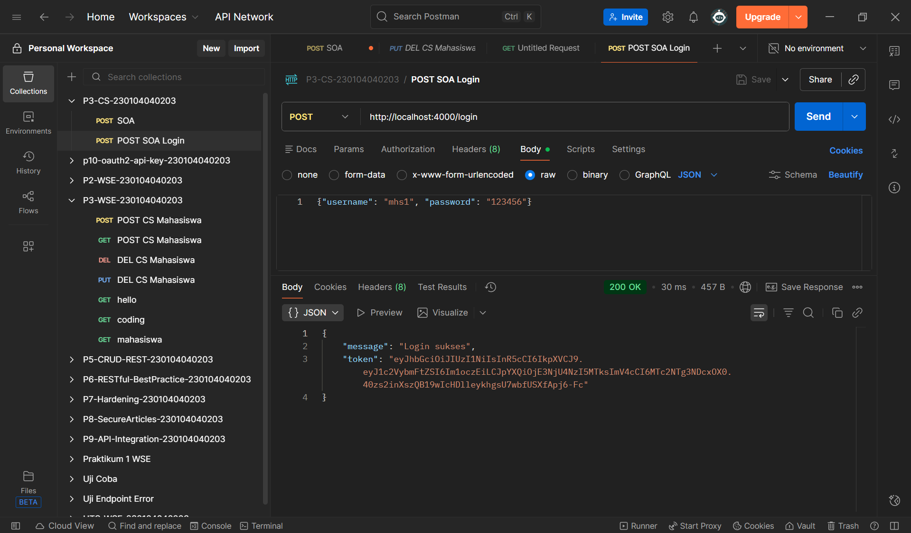
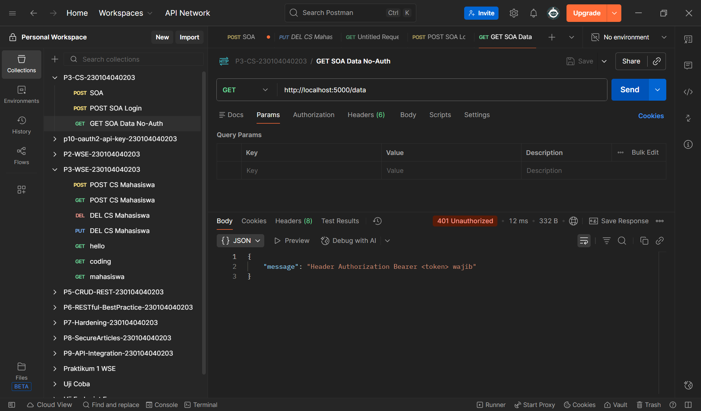
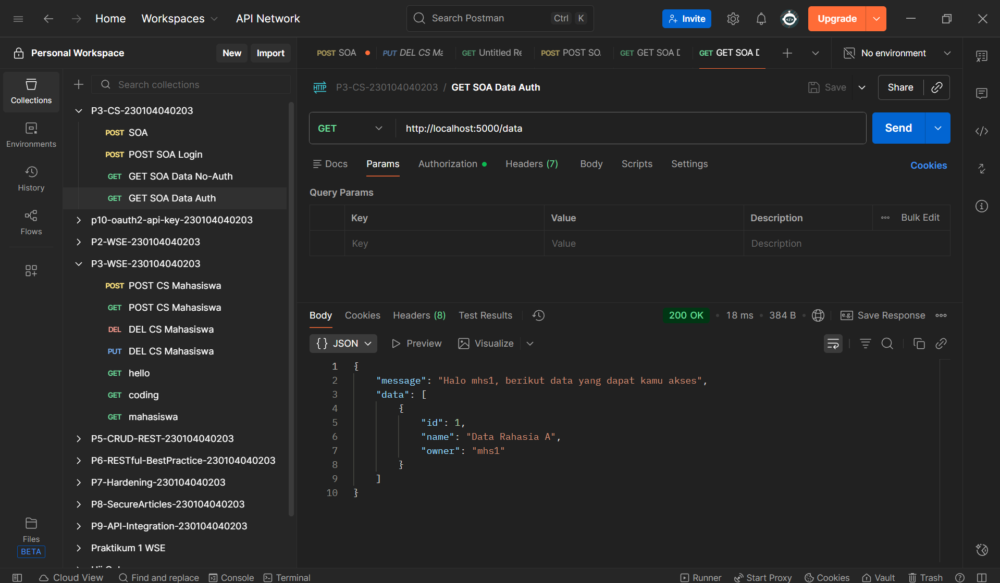

# Praktikum 3 – Web Service Engineering  
## Simulasi Service Oriented Architecture (SOA)

**Nama**    : Nor Hayati  
**NIM**     : 230104040203  
**Kelas**   : TI23A  

**Mata Kuliah** : Web Service Engineering  
**Topik** : Service Oriented Architecture (SOA)  
**Teknologi** : Node.js, Express.js, JWT, Postman  

---

## 📁 Struktur Project
````bash
P3-SOA-230104040203
│
├── README.md
│
├── auth-service
│ ├── node_modules
│ ├── .env
│ ├── package.json
│ ├── package-lock.json
│ └── server.js
│
├── data-service
│ ├── node_modules
│ ├── .env
│ ├── authMiddleware.js
│ ├── package.json
│ ├── package-lock.json
│ └── server.js
│
└── foto
├── 17.postsoa.png
├── 18.soalogin.png
├── 19.getsoadata_noauth.png
├── 20.getsoadata_auth.png
└── 21.postsoadata.png
````

---

## 🧩 Konsep SOA

Service Oriented Architecture (SOA) adalah arsitektur aplikasi yang memisahkan sistem menjadi beberapa **service independen** yang saling berkomunikasi menggunakan API.

Pada praktikum ini:
- **Authentication Service** berfungsi untuk proses login dan pembuatan token JWT.
- **Data Service** hanya dapat diakses jika request menyertakan token JWT yang valid.

---

## 🔐 Authentication Service (`auth-service`)

### 1️⃣ Konfigurasi `.env`
````bash
env
PORT=4000
JWT_SECRET=rahasia123
````
2️⃣ Menjalankan Service
````bash
npm install
npm run dev
````
Service berjalan pada:
````bash
http://localhost:4000
````
3️⃣ Endpoint Login
POST /login

Body (JSON):
````bash
{
  "username": "mhs1",
  "password": "123456"
}
````
Jika login berhasil, server akan mengembalikan JWT Token.
Jika gagal, server akan mengembalikan status 401 Unauthorized.

📸 Screenshot:


📦 Data Service (data-service)
1️⃣ Konfigurasi .env
JWT_SECRET harus sama dengan Authentication Service
````bash
env
PORT=5000
JWT_SECRET=rahasia123
````
2️⃣ Menjalankan Service
````bash
npm install
npm run dev
````
Service berjalan pada:
````bash
http://localhost:5000
````

🛡️ Middleware Autentikasi
File authMiddleware.js digunakan untuk:

Mengambil token dari header Authorization

Memverifikasi token JWT

Menolak request tanpa token atau token tidak valid

🔎 Pengujian Menggunakan Postman

🔹 1. Login
POST 
````bash
http://localhost:4000/login
````
📸 Screenshot Login SOA


🔹 2. Akses Data Tanpa Authorization
GET 
````bash
http://localhost:5000/data
````

Hasil:

❌ 401 Unauthorized

📸 Screenshot GET Data Tanpa Authorization




🔹 3. Akses Data Dengan Authorization
GET 
````bash
http://localhost:5000/data
````

Header:
````bash
Authorization: Bearer <token>
````

Hasil:

✅ 200 OK

📸 Screenshot GET Data Dengan Authorization




🔹 4. Tambah Data
POST http://localhost:5000/data

Header:

makefile
````bash
Authorization: Bearer <token>
````

Body (JSON):
````bash
{
  "name": "Data Rahasia C"
}
````
📸 Screenshot POST Data SOA


📌 Kesimpulan
-->SOA memungkinkan pemisahan fungsi sistem menjadi service yang berdiri sendiri

-->Authentication dan Data Service berjalan terpisah namun saling terhubung

-->JWT digunakan sebagai mekanisme keamanan

-->Data Service tidak dapat diakses tanpa autentikasi
